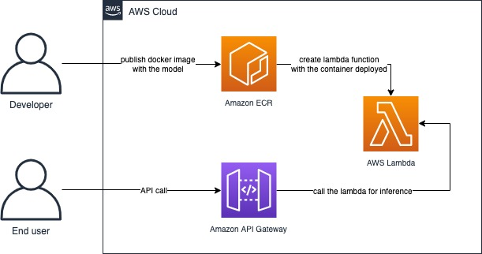

# Deploying a machine learning model on AWS Lambda using Docker
> An end-to-end demo for deploying a serverless inference application based on a pre-trained version of SqueezeNet that you can deploy with the SAM CLI.

SqueezeNet is a Deep Learning neural network for computer vision that offers AlexNet level accuracy with 50x fewer parameters and a much smaller model size (approx. 10 MB in this example)
It includes the following files and folders.

Inference - Code for the application's Lambda function and Project Dockerfile.

events - Invocation events that you can use to invoke the function. (Not used in this example)

tests - Unit tests for the application code.

template.yaml - A template that defines the application's AWS resources.

The application uses several AWS resources, including Lambda functions and an API Gateway API. These resources are defined in the template.yaml file in this project. You can update the template to add AWS resources through the same deployment process that updates your application code.

Lead Maintainer: [Dorian Richard](mailto:dorianri@amazon.com)

## 📋 Table of content

 - [Installation](#-install)
 - [Metrics](#-metrics)
 - [Pre-requisites](#-pre-requisites)
 - [Description](#-description)
 - [Usage](#-usage)  
 - [Warnings](#-warnings) 
 - [Contributing](#-contributing--next-steps)   
 - [See also](#-see-also)

## 🚀 Install

### 1. Fork this repository
To get started, fork this repository using Git commands:
```shell
git clone <Replace With This Repo Url>
```

### 2. Deploy the project using SAM CLI
The Serverless Application Model Command Line Interface (SAM CLI) is an extension of the AWS CLI that adds functionality for building and testing Lambda applications. It uses Docker to run your functions in an Amazon Linux environment that matches Lambda. It can also emulate your application's build environment and API.

To use the SAM CLI, you need the following tools.

* SAM CLI - [Install the SAM CLI](https://docs.aws.amazon.com/serverless-application-model/latest/developerguide/serverless-sam-cli-install.html)
* Docker - [Install Docker community edition](https://hub.docker.com/search/?type=edition&offering=community)

You may need the following for local testing.
* [Python 3 installed](https://www.python.org/downloads/)

To build and deploy your application for the first time:

* Clone this repo
* cd into the lambda-container-dl-inference directory
* run the following in your shell:

```bash
 sam build && sam deploy --guided --stack-name lambda-sqnet-inference 
```

The first command will build a docker image from a Dockerfile and then copy the source of your application inside the Docker image. The second command will package and deploy your application to AWS, with a series of prompts:

* **Stack Name**: The name of the stack to deploy to CloudFormation. This should be unique to your account and region, and a good starting point would be something matching your project name. We have specified the stack name in the above example command. You can choose to alter it
* **AWS Region**: The AWS region you want to deploy your app to.
* **Confirm changes before deploy**: If set to yes, any change sets will be shown to you before execution for manual review. If set to no, the AWS SAM CLI will automatically deploy application changes.
* **Allow SAM CLI IAM role creation**: Many AWS SAM templates, including this example, create AWS IAM roles required for the AWS Lambda function(s) included to access AWS services.Select 'Y' for this option 
* **Save arguments to samconfig.toml**: If set to yes, your choices will be saved to a configuration file inside the project, so that in the future you can just re-run `sam deploy` without parameters to deploy changes to your application.

You can find your API Gateway Endpoint URL in the output values displayed after deployment.

## 📊 Metrics

The below metrics displays approximate values associated with deploying and using this block.

Metric | Deployment  | Model size
------ | ------ | ------
 **Time** | 2 minutes | 25 minutes | 
 **Volume** | NA | NA | ~2 MB 

## 🎒 Pre-requisites

- AWS SAM CLI (test on v1.91)
- Python 3.8

## 🔰 Description

The goal of this demo is to showcase customers how you can integrate quickly deploy and run a pre-trained machine learning model on AWS Lambda Container using AWS SAM CLI.



## 🛠 Usage 

To test the API, send a couple of requests:

```bash
curl -s "<API Endpoint URI>/inference?url=https://images.freeimages.com/images/large-previews/0db/tropical-bird-1390996.jpg"
curl -s "<API Endpoint URI>/inference?url=https://images.freeimages.com/images/large-previews/13f/natal-sofia-4-1431300.jpg"
curl -s "<API Endpoint URI>/inference?url=https://images.freeimages.com/images/large-previews/25d/eagle-1523807.jpg"
```

### 🏃 Running the demo 

Follow the instructions above.

## ⚠️ Warnings

## ⚙️ Contributing / Next Steps  
- [ ] optimize the model size using Amazon Sagemaker Neo to optimize the run cost.

## 👀 See also

List here any resources that helps the audience to understand how the demo works

 - [Creating Lambda container images](https://docs.aws.amazon.com/lambda/latest/dg/images-create.html) official documentation
 - [AWS SAM CLI](https://aws.amazon.com/fr/serverless/sam/)
 - [SqueezeNete model](https://arxiv.org/abs/1602.07360)

 (An AWS Blog post is coming soon...)